# ICCAD 2026 FloorSet Challenge — five-stage floorplanner

Team **cadc1035**, Problem C (Data-Driven SoC Floorplanning).

This branch carries the complete solver together with the organizers' framework:

- `iccad2026contest/` — the optimizer, all five stages, plus the contest evaluator and the trained checkpoint.
- everything at the repository root (`LiteTensorDataTest/`, `cost.py`, `utils.py`, the loaders, `visualize.py`, …) — the organizers' code and data, unchanged. Their own README is kept as [README_floorset.md](./README_floorset.md), and the contest guide stays at [iccad2026contest/README.md](./iccad2026contest/README.md).

One call to `MyOptimizer.solve()` takes block areas, the two netlists, pin coordinates and the constraint table, and returns one rectangle per block.

---

## Results

100 visible cases (`LiteTensorDataTest`), deterministic, from a clean clone under `env -i`.

| Metric | Value | Note |
|---|---|---|
| Total Score, `e^(n/12)` | **1.1459** | team evaluator weighting |
| Total Score, `e^n` | 1.1845 | v9 PDF weighting |
| Avg Cost | 1.1705 | unweighted mean |
| Feasible | 100 / 100 | and 4000 / 4000 over 40 synthetic suites |
| Official score with runtime | 0.8021 | against the beta per-case medians |
| Runtime per case | 0.38 s (Mac) · 0.51 s (Linux i9-10900) | field median 2.96 s |
| Median runtime ratio R | 0.156 | the floor is R ≤ 0.3046 |
| Cases on the runtime floor | 97 / 100 | weighted runtime factor 0.7018 of a best-possible 0.7000 |

The two weightings disagree, so both are reported. The per-case cost is

```
cost = (1 + 0.5·(hpwl_gap + area_gap)) · exp(2·V_rel) · max(0.7, R^0.3)
```

Violations enter through an exponential and wirelength only linearly, which is why the packer pays far more for a broken cluster than for a longer wire.

The runtime discount is already fully collected: 97 of 100 cases sit exactly on the floor, so spending time to buy quality is cheap and spending quality to buy speed is worthless.

---

## Pipeline

```
areas, b2b, p2b, pins, constraints
      │
      ├─ STAGE 1  GNN                 shapes + rough positions
      ├─ STAGE 2  electrostatic       spread, still overlapping
      ├─ STAGE 3  legalizer           the only stage that guarantees legality
      ├─ STAGE 5  cluster closure     contacts made exact before the solve
      ├─ STAGE 4  SOCP polish         geometry re-solved at fixed topology
      └─ STAGE 5  cluster closure     contacts repaired after the solve
      │
      n rectangles (x, y, w, h)
```

Stage 5 runs on both sides of stage 4, so the real order is 1 → 2 → 3 → 5 → 4 → 5.

---

### Stage 1 — Graph convolution

`model.py`, `ml_utils.py`, checkpoint `floorplan_gnn_ar9_final.pth`

A three-layer GCN reads the netlist as a graph and emits a shape and a rough position for every block at once — the only stage that sees the problem globally before any geometry is committed.

```
x → GCNConv(13→128) → ReLU → GCNConv(128→128) → ReLU → GCNConv(128→128) → ReLU → Linear(128→4)

w = softplus(o₀) + 1e-3      h = softplus(o₁) + 1e-3      xy = o₂, o₃
```

The 13 node features are area, is_fixed, is_preplaced, mib_id, cluster_id, boundary_code, gravity_x, gravity_y, has_pin, plus the four mandated values (target x, y, w, h; −1 where absent) so the network can plan around immovable blocks. Predicted `w, h` are used only for their **ratio**: the area always comes from the target, because area is a hard constraint.

---

### Stage 2 — Electrostatic spreading

`stage2_electrostatic.py`

Five forces on a canvas that shrinks as the run proceeds. One pushes, four pull.

| Force | General form | Effect | Weight |
|---|---|---|---|
| Density | `F = q·E(u)`, `q = w·h` | pushes out of crowding | ≤ 1 |
| Boundary | `F = k_b·(x_edge − x)/W` | pulls to its required edge | 3.0 |
| Cluster | `F = k_c·(m_g − u)/W` | pulls to its cluster anchor | 2.0 |
| Pin | `F = (k_p/d)·Σ ω(π − u)/W` | pulls to its pins | 1.5 |
| Netlist | `F = (k_n/d)·Σ ω(u_j − u)/W` | pulls to wired blocks | 1.0 |

`u` is a block centre, `W` the canvas width, `d` is 1 + degree, `m_g` the cluster anchor, `ω` a net weight, `π` a pin position. All spring weights are tripled for cases of 70 blocks or fewer. The density field is normalised so its strongest push is exactly 1, and the springs are not, so a constraint wins any tie with crowding.

**The density force is a field, not pairwise repulsion.** Block areas are rasterised onto a 64×64 grid, Poisson is solved on that grid by a cosine transform, and the force is the negative gradient of the potential:

```
ρ[r,c] = Σ area(block ∩ cell)          exact rectangle-bin overlap
∇²ψ = −ρ        solved in the DCT domain:  λ_k = 2(1 − cos(π·k/M)),  ψ̂ = ρ̂/(λ_r + λ_c),  ψ̂[0,0] = 0
E = −∇ψ         f_density = q · E(bin of the block centre)
```

| ρ — where blocks pile up | ψ — the potential | E — the push each block feels |
|---|---|---|
| 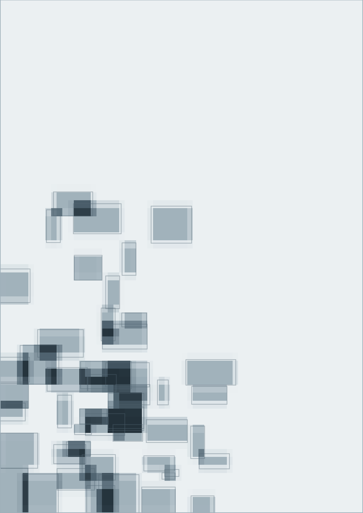 | 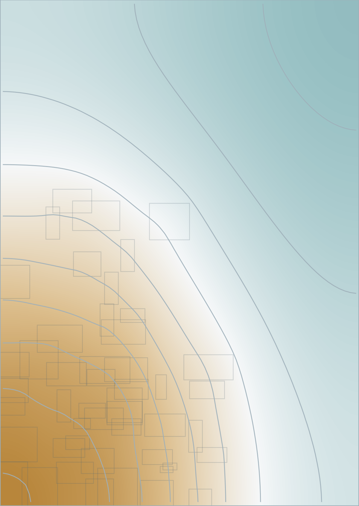 | 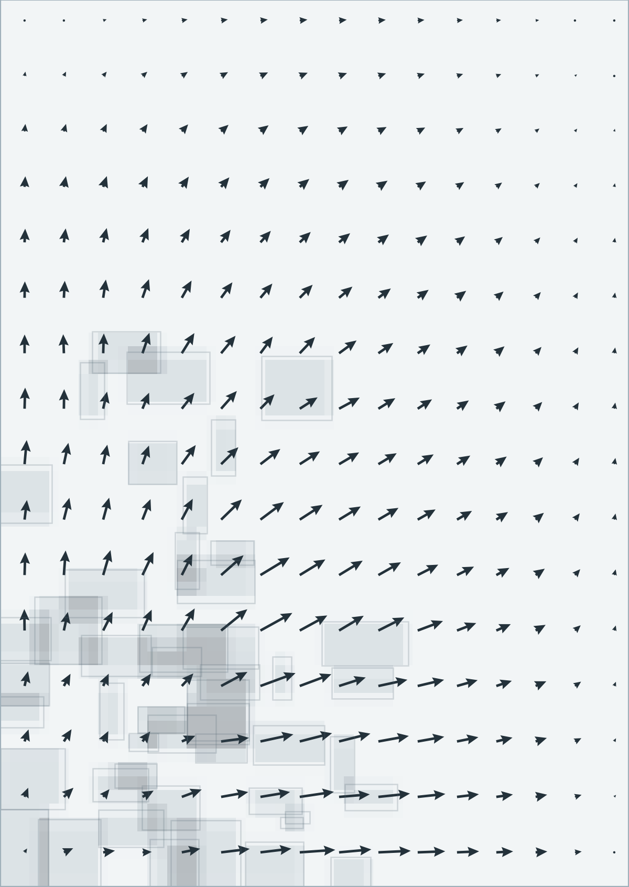 |

One solve gives every block the combined push of all the others, so a crowded corner moves blocks across the whole canvas.

The canvas anneals from six times the total block area down to exactly that area over the first 20% of the rounds, then holds:

```
frac  = min(1, (it/rounds)/anneal_frac)          anneal_frac = 0.2
cap_t = cap_start + (cap_end − cap_start)·frac   cap_start = 6.0, cap_end = 1.0
W = sqrt(cap_t·A·ar),  H = sqrt(cap_t·A/ar)
```

Constraints settle first and packing takes over late, and nothing in the code splits the two phases — the boundary spring is proportional to the distance left, so it fades as blocks arrive, while every other spring divides by the canvas width and strengthens as the canvas shrinks.

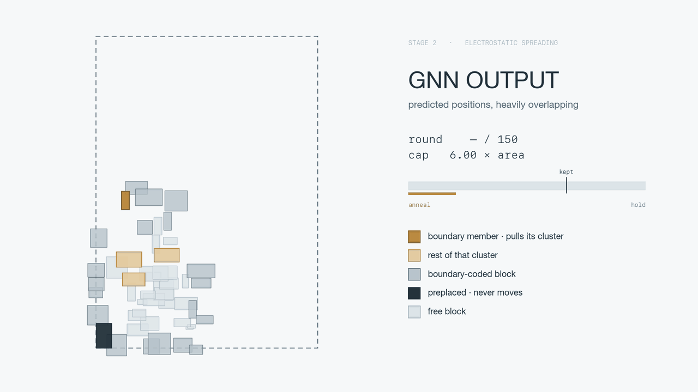

*Case 27, 48 blocks. The dark brass block is coded to the top edge and heads there first; the rest of its cluster follows. The round with the least overlap is handed on, not the last one.*

---

### Stage 3 — The legalizer

`stage3_legalizer.py`

The only stage that guarantees a legal result: zero overlap, every hard constraint met. It builds the frame outside-in.

| 1 · Bottom row | 2 · Top row on the ceiling | 3 · Side towers | 4 · Stretched to the lid |
|---|---|---|---|
| 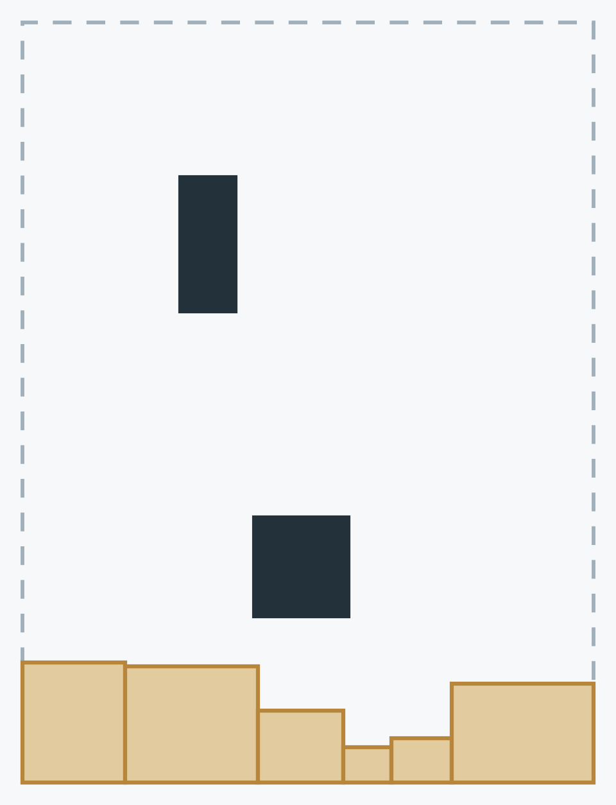 | 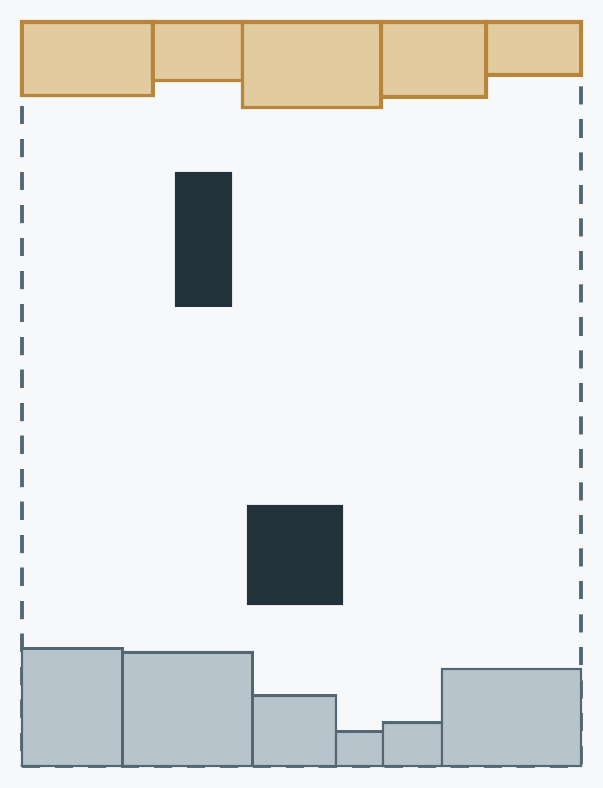 | 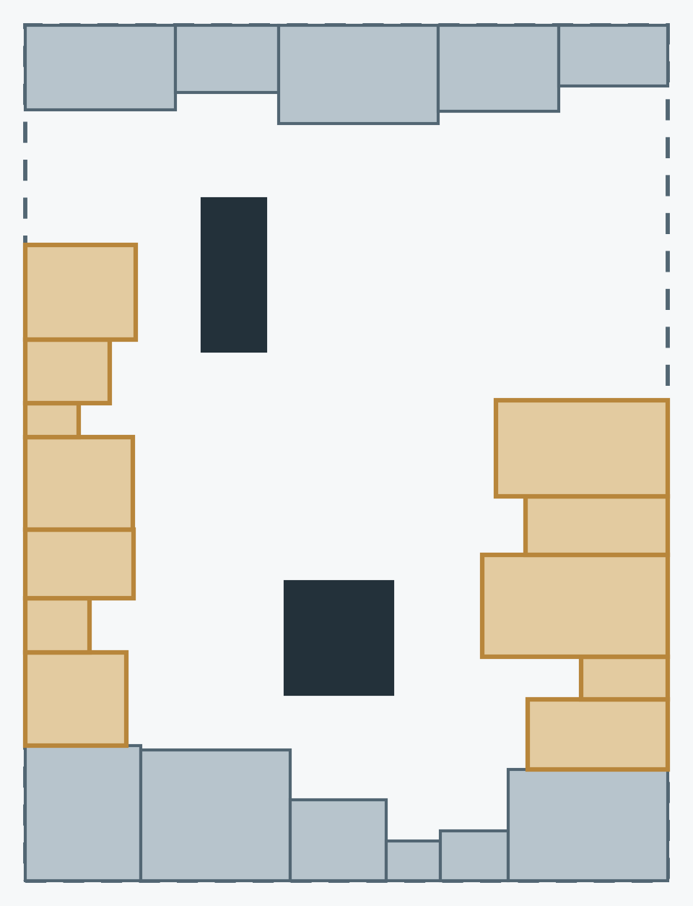 | 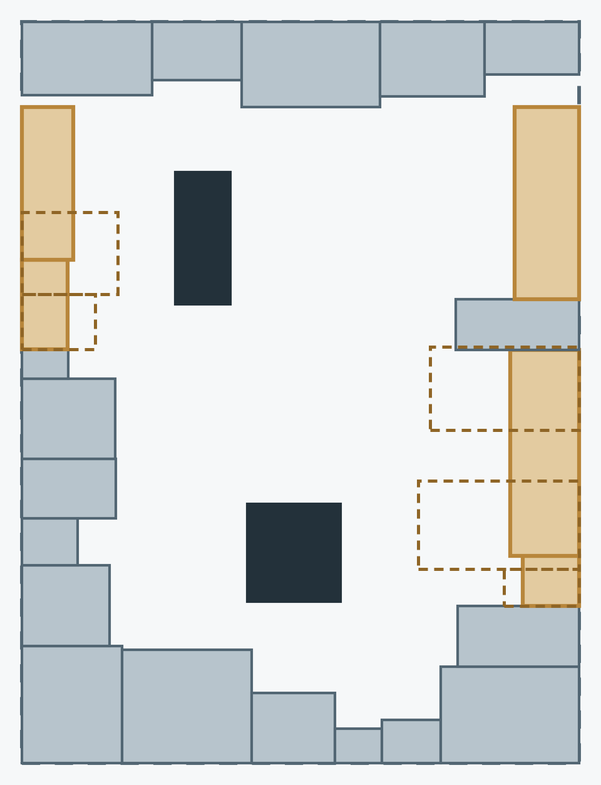 |

The frame width is chosen once, before anything is placed:

```
A  = Σ block areas,  ar = clamp(W₀/H₀, 0.25, 4.0)      from the stage-2 extent
W  = max( sqrt(A/util · ar), widest block ),  util = 0.85
```

Putting the top row on early gives the towers a mark to reach. Each tower block then grows upward at constant area — so it narrows and hands width back to the interior — until it meets the underside of the top row, the **lid**. On case 36 the right tower stood 56.5 units short of the lid, and the stretch closes that to zero.

**The interior** is a MaxRects free-rectangle fill. Every maximal empty rectangle is a candidate; each block is tried in three widths at the rectangle's floor, as close as the rectangle allows to where stage 2 put it.

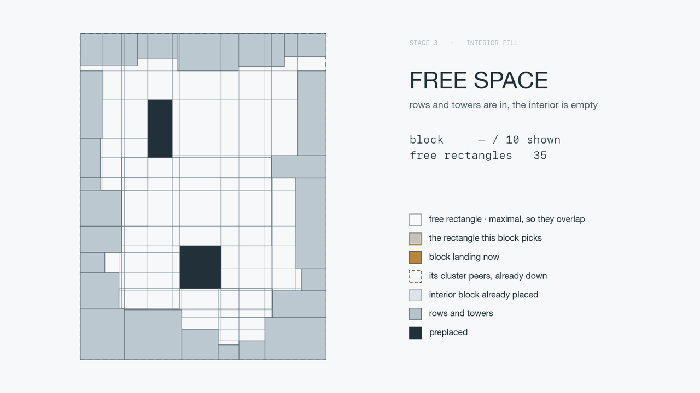

```
shape candidates per free rect (r_w × r_h), soft block of area a:
    w ∈ { w_current, min(w_current, r_w), a/r_h }      clamped to aspect ratio ≤ 3

landing score, lowest wins:
    s = 0.5 · ΔHPWL / HPWL_ref        wirelength
      + 32  · gap / sqrt(A)           distance to the nearest placed cluster peer
```

No landing may rise above the lid, so the frame is already settled and only wires and clusters decide. (The code also scores frame growth, `W·max(0, y + h − H)/A`; the stretched towers put `H` at the lid, so it is 0 under the lid and only fires when a block fits nowhere and the lid has to lift.)

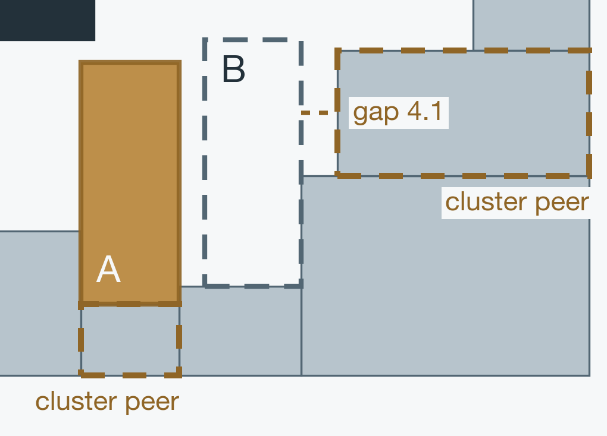

*Case 36, block 53. Landing A sits on its cluster peer 44: wire 0.063, cluster 0, total 0.063. Landing B has shorter wires by 0.0014 but lands 4.1 from the nearest peer, which costs 0.95. The weight of 32 is what makes a cluster contact outrank any realistic wirelength saving — grouping enters the cost through `exp(2·V_rel)`.*

A two-tier safety net closes the stage: for every overlapping pair the smaller block moves along whichever axis needs less travel, and tier 2 drops the boundary/preplaced protection, which is what makes zero overlap a guarantee rather than a hope.

---

### Stage 4 — Second-order cone polish

`stage4_socp.py` — after UFO/SOPL (Lin & Hung, TCAD 2011, §IV-B)

The legalizer's output is legal but loose: median bounding-box density 0.833. This stage keeps the topology and re-solves the geometry. For every pair of blocks the separation that already holds becomes a constraint, and edges implied by a two-step path are dropped — on case 36 that is 707 + 889 relations reduced to 155 + 147.

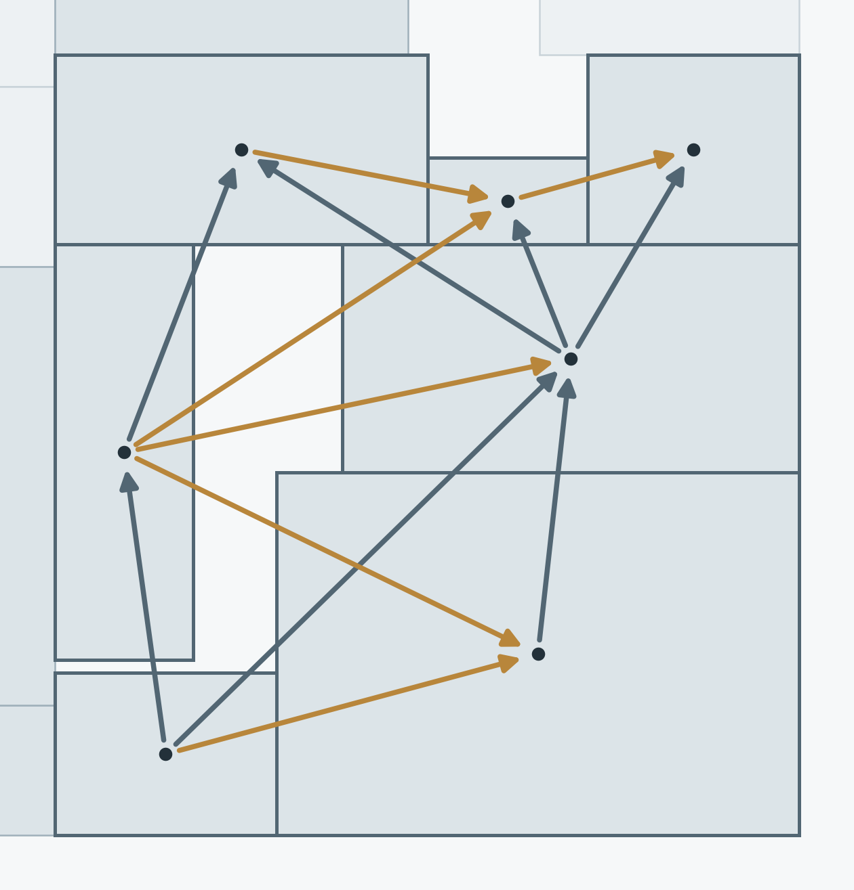

*A corner of case 36: brass is "left of" (C_h), slate is "below" (C_v).*

```
min   H₀·W + W₀·H                            linearised bbox area
    + c · Σ_e ω_e · (t_x,e + t_y,e)           wirelength,  c = 0.03·W₀H₀/HPWL₀
    + g · Σ_i (x_i + y_i)  +  μ · Σ_i (w_i + h_i)      gravity 1e-3, shape 0.01, both ×(W₀+H₀)/n

s.t.  x_i + w_i ≤ x_j   (i,j) ∈ C_h,     y_i + h_i ≤ y_j   (i,j) ∈ C_v
      0 ≤ x_i,  x_i + w_i ≤ W ≤ W₀            the frame may only shrink
      0 ≤ y_i,  y_i + h_i ≤ H ≤ H₀
      t_e ≥ ±(c_i − c_j),  c = x + w/2        per axis; a pin enters as a constant
      w_i·h_i ≥ A_i    ⟺    h_i + w_i ≥ ‖(h_i − w_i, 2·sqrt(A_i))‖₂
      w_i ≤ 3·h_i,  h_i ≤ 3·w_i
```

Boundary codes, preplaced blocks, fixed shapes, MIB groups and every existing cluster contact are held as equalities; a held contact also keeps at least half of its perpendicular overlap, so two peers cannot slide apart along a shared edge. The area constraint is the only non-linear one and it is exactly a second-order cone, which is what makes the whole model an SOCP. Solved with **Clarabel** (Apache-2.0, no licence file), tolerance 1e-12 relaxing to 1e-10 and 1e-8; accepted on 100 of 100 cases.

| SOCP input · 131.0 × 174.4 | SOCP output · 124.3 × 160.2 |
|---|---|
| 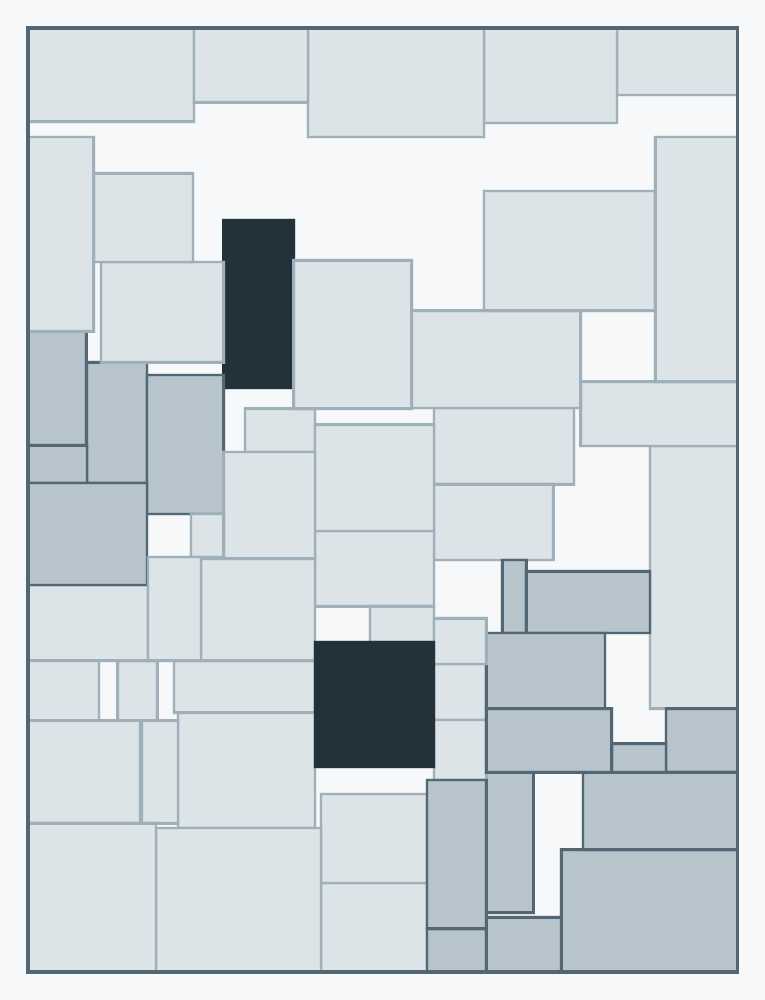 | 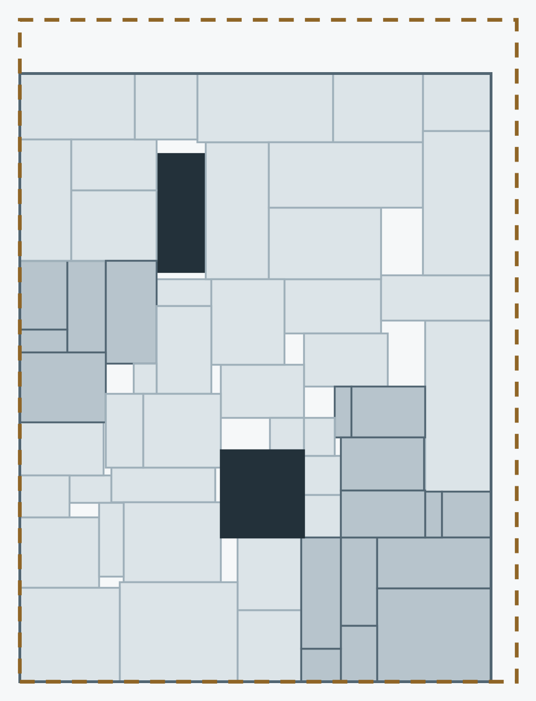 |

Across the suite: bounding-box area −11.5% (median, from −1.2% to −33.8%), wirelength −4.6%, density 0.833 → 0.930. Afterwards, shapes are scaled back to exactly their target area, boundary blocks within 1e-3 of the frame are snapped onto it, and residual overlap, an area outside 1% or an aspect ratio over the cap all return `None`, keeping the stage-3 layout.

---

### Stage 5 — Cluster closure

`refine_clusters.py`

A cluster counts as satisfied only when its members form one connected component, and the evaluator decides that with a Shapely union whose tolerance is **exactly zero**.

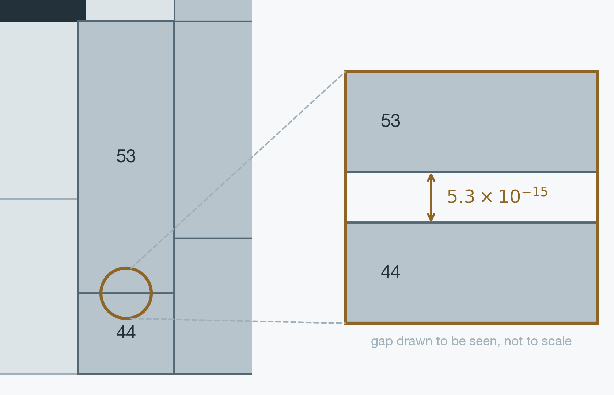

*After the SOCP, block 53 still looks like it sits on peer 44. The top of 44 is `8.6717831982594`, the bottom of 53 is `8.671783198259405` — three ulps apart, so the cluster counts as two pieces. Suite-wide, 1,329 of 1,954 cluster contacts came out of the solve no longer exact, 1,283 of them by less than 1e-6.*

The repair has to be arithmetic, not geometric: `x + gap` lands within an ulp of the target, and an ulp is a MultiPolygon. The moving block is **assigned** the neighbour's edge, the very expression Shapely builds that edge from:

```
P[hi, axis] = P[lo, axis] + P[lo, size]
```

Three moves, tried in order:

| 1 · Move the piece | 2 · Move one block | 3 · Grow an edge |
|---|---|---|
| 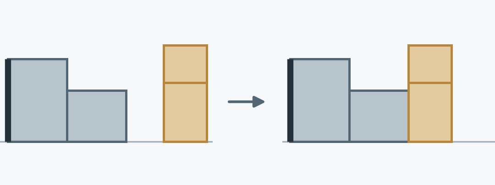 | 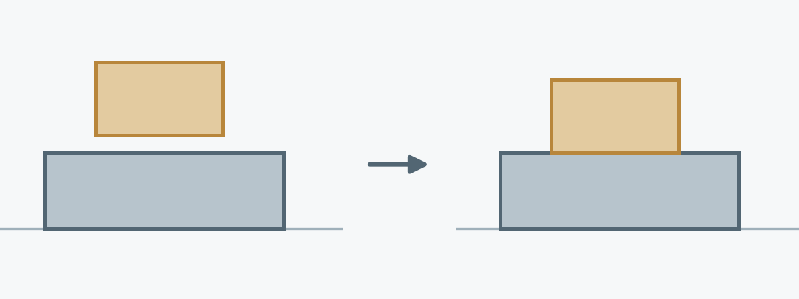 | 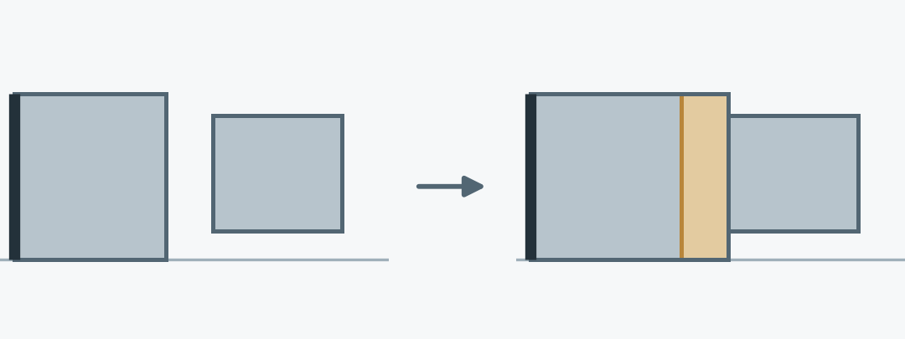 |
| the less anchored piece travels to the other and its own contacts are rebuilt by assignment | when no whole piece can travel, one block takes its neighbour's edge | when nothing can slide, a soft block extends its facing edge across a gap ≤ 2, spending ≤ 0.5% of its area |

Preplaced blocks never move, a boundary block slides only along its own edge, a move is kept only if the destination is clear and the bounding box is unchanged, and a round merges at most one pair per cluster (up to 40 rounds).

Split clusters over the suite: **193** after stage 3 → **90** after the first closure → **777** after the SOCP → **64** after the second.

---

## Running it

```bash
cd iccad2026contest
pip install -r requirements.txt
python iccad2026_evaluate.py --evaluate my_optimizer.py
```

`clarabel` and `scipy` are what stage 4 needs; without them the stage disables itself silently and the score falls by about 0.12. `torch_geometric` is a hard dependency of `model.py` as it stands in this branch — see *Packaging* below.

Every constant that matters ships as a literal in the source. The environment variables in the code are development knobs: the grader runs with a bare environment, and every default equals the configuration these numbers were measured with.

| Stage | Constant | Ships as |
|---|---|---|
| 2 | anneal_frac · rounds · force gain | 0.2 · 150/450 (split at 70 blocks) · 3.0/1.0 |
| 2 | cap_start · cap_end | 6.0 · 1.0 |
| 2 | boundary · cluster · pin · netlist | 3.0 · 2.0 · 1.5 · 1.0 |
| 3 | frame-width sweep · util · aspect cap | single width · 0.85 · 3.0 |
| 3 | cluster-gap weight · wirelength weight | 32.0 · 0.5 |
| 4 | solver · wirelength weight | clarabel · 0.03 |
| 5 | growth budget · largest gap closed · rounds | 0.005 · 2.0 · 40 |

---

## Repository layout on this branch

```
iccad2026contest/
    my_optimizer.py            STAGE 1 + the driver (frame-width sweep, variant scoring, fork pool)
    stage2_electrostatic.py    STAGE 2
    stage3_legalizer.py        STAGE 3
    stage4_socp.py             STAGE 4
    refine_clusters.py         STAGE 5
    model.py, ml_utils.py      the GCN and its graph builder
    floorplan_gnn_ar9_final.pth   the shipped checkpoint (the other .pth files are training snapshots)
    iccad2026_evaluate.py      the organizers' evaluator
    visualize.py               renders a saved solutions file, ours against ground truth
docs/img/                      the figures and animations used in this README
LiteTensorDataTest/, cost.py, utils.py, *Loader.py, validate.py   the organizers' framework
```

The three-stage snapshot that used to sit in `GNN_electrostatic_legalizer/` is not carried onto this branch; it lacked stages 4 and 5 and only invited packaging the wrong copy. It remains in the history of `GNN+electrostatic+legalizer`.

---

## Packaging for submission

The submitted bundle differs from this branch in exactly one respect: `model.py` and `ml_utils.py` are replaced by torch_geometric-free equivalents (a small pure-PyTorch GCN layer whose parameter names match `torch_geometric.nn.GCNConv`, verified bit-identical on all 100 cases, and a ~10-line `Data` container), because the evaluation environment provides numpy, torch, scipy, numba, tqdm, shapely and threadpoolctl but not torch_geometric. `clarabel`, `cffi` and `pycparser` are vendored as wheels and installed with `pip install --no-index --find-links=wheels -r requirements.txt`, since the grading machine has no network.

---

## What is left on the table

63 of 100 cases still carry a soft violation: 37 boundary misses across 30 cases, 64 grouping splits across 48 cases, no MIB violations. Clearing them is worth roughly 0.02 of Total each, more than every parameter change in the current configuration put together.

Both have the same root cause. Every boundary miss is a preplaced block that cannot move, so the frame edge has to come to it; that mark equals ground truth's frame height in 25 of the 28 cases where it exists, and our frame overshoots it in all 25. Fitting inside it requires packing as tightly as ground truth does, and the gap is four percentage points of density:

| Packing density | Value |
|---|---|
| Ground truth | 0.971 |
| This pipeline | 0.930 |
| `util` assumed for frame sizing | 0.850 |

Measured and rejected, so they are not worth retrying: deriving the frame width from the pinned mark at any slack from −5% to +25%; excluding the pinned block from the ceiling; making it a member of the top row; one corrective re-pack on overflow; flattening the towers against the mark; the transposed packing mode; raising `util`; a five-width frame sweep (a wash on quality, and it costs the runtime floor on the heaviest case); and three ways of pressing the interior to pack tighter (a MaxRects contact-point term, extra candidate x positions at each free rectangle's edges, and re-enabling frame growth by leaving the towers out of `H`) — each trades about 0.005 of area_gap for 0.01–0.03 of hpwl_gap, which is a net loss.
